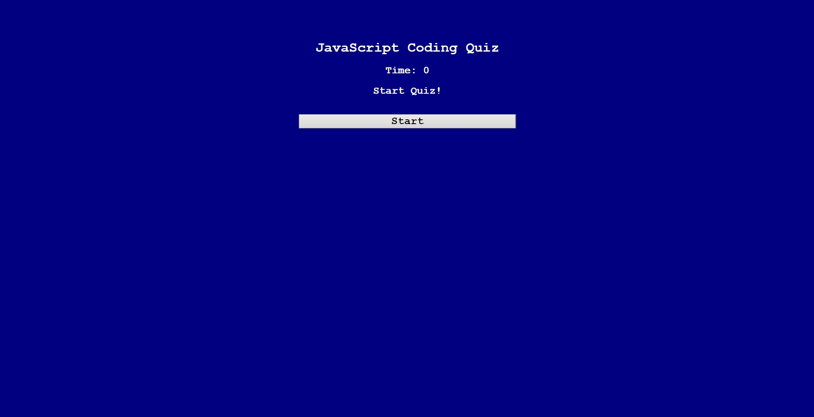
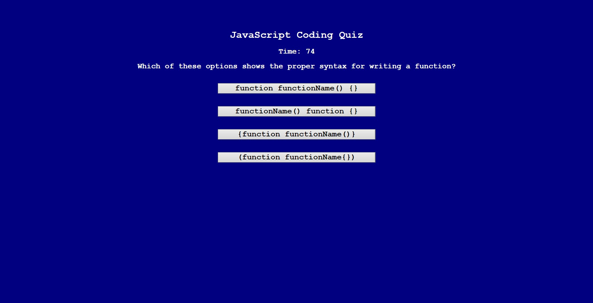
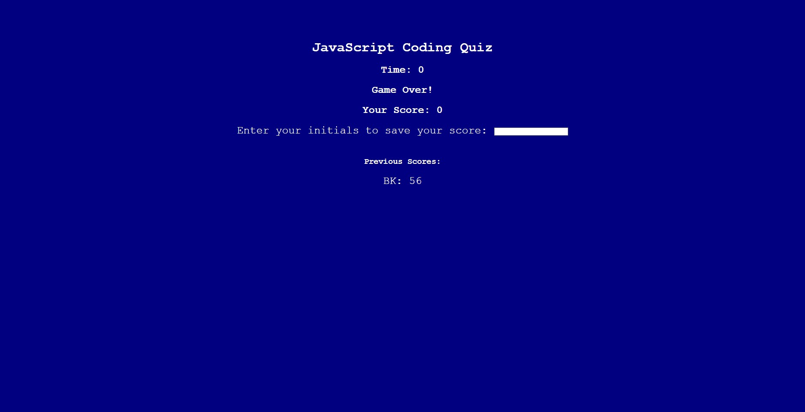

# JavaScript Code Quiz

## Description

People benefit from certain methods of learning more than others. Some like to test themselves by recalling information from memory with no outside resources helping or prompting them; others thrive on visual recognitions when being presented with multiple choices to an answer. I find that this latter process is very effective in learning vocabulary for words, so I created this website with the goal of testing my knowledge of fundamental JavaScript concepts so that I can compare my progress to my peers. While simple as it may be, the process of designing questions and answers helps reinforce my understanding of content and my ability to write dense terminology in my own words.

## Usage

Click on this link to visit the GitHub Pages website: https://abrentis.github.io/Code-Quiz/

Here is a preview of what the website looks like:

After clicking the 'Start' button, you will be presented with a series of quiz questions. For example:

If you guess a question incorrectly, seconds will be subtracted from the timer.

If you answer all questions correctly or if the timer runs out, you will see the post-quiz screen. To save your score, enter your initials into the input field and press the 'Enter' key so that it is saved under "Previous Scores."

To take the quiz again, refresh the page. Previous scores that had been entered during previous attempts will be saved under "Previous Scores."

## Credits

To help myself get a sense of the general bone structure of this website when I was creating it, I referred to this YouTube video by GreatStack:

https://www.youtube.com/watch?v=PBcqGxrr9g8

## License

MIT license (please refer to GitHub repo for more information)